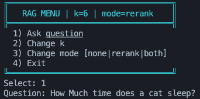
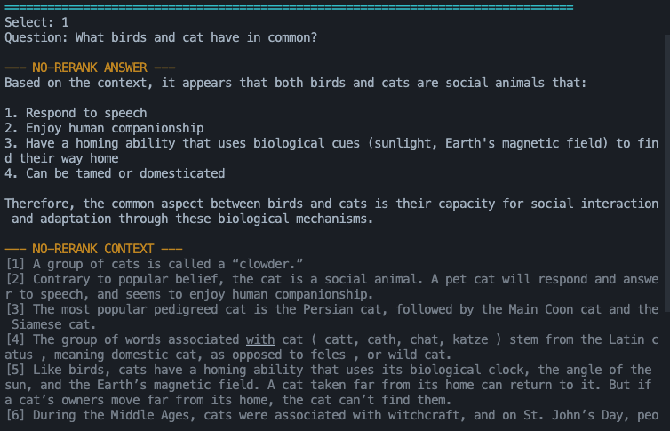

# Ollama RAG + Reranker (CLI)

Simple Retrieval-Augmented Generation system using:

- **Ollama** for embeddings and chat generation
- **HNSWVectorDB** for vector search
- **FlagEmbedding** reranker (optional)



## Quick Start

```bash
# Install dependencies
uv sync

# (Optional) Make sure Ollama models are available locally
# ollama pull hf.co/CompendiumLabs/bge-base-en-v1.5-gguf:Q4_K_M
# ollama pull hf.co/bartowski/Llama-3.2-1B-Instruct-GGUF:Q4_K_M

# Run interactive CLI
uv run --active python main.py

# The app builds the index on first run automatically
```

## How it Works

- `src/rag/embedding.py`: Embeds text with Ollama.
- `src/db/db_handler.py`: HNSW index for `TextDoc`, search + convenience helpers.
- `src/rag/rerank.py`: Lazy-loaded reranker (`BAAI/bge-reranker-base`) to rescore candidates.
- `src/rag/llm.py`: Generates the final answer from context using an Ollama chat model.

## Project Structure

```
ollama-rag-reranker/
├── assets/                  # README images (screenshots)
├── data/
│   └── cat-facts.txt        # Sample corpus
├── main.py                  # Interactive CLI
└── src/
    ├── data/dataio.py
    ├── db/db_handler.py
    └── rag/
        ├── embedding.py
        ├── llm.py
        └── rerank.py
```

## Interactive CLI

Menu-driven, clean output with colors:

```
$ uv run --active python main.py
========================================
       RAG MENU | k=6 | mode=none
========================================
  1) Ask question
  2) Change k
  3) Change mode [none|rerank|both]
  4) Exit
╚══════════════════════════════════════════════╝
Select: 1
Question: How much time does a cat sleep?

--- NO-RERANK ANSWER ---
... generated answer ...
├────────────────────────────┤
[1] Cats sleep 16 to 18 hours per day.
...
└────────────────────────────┘

--- RERANK ANSWER ---
... generated answer ...
├────────────────────────────┤
[1] Cats sleep 16 to 18 hours per day.
...
└────────────────────────────┘
```

## Configuration

Change default models in:

- `src/rag/embedding.py`: `emb_model`
- `src/rag/llm.py`: `model`, `system_prompt`

## Screenshots


